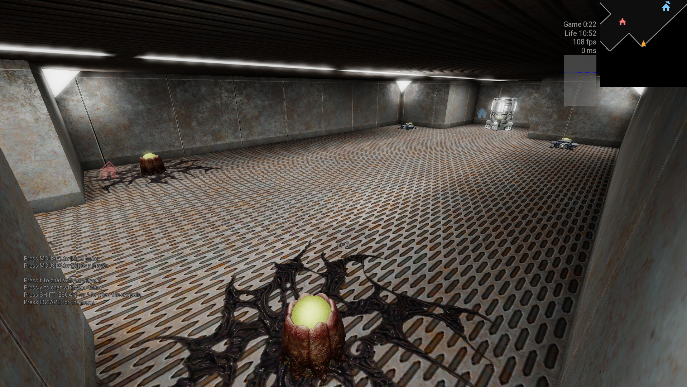

# Unvanquished Map Starter

This app helps you create your map for Unvanquished. It creates the default folders for your map, including a small default map, DEPS file, arena file, and other necessary files.

## How to Run

### Windows
1. Double-click on the `unvanquished_map_starter.exe` file
2. A console window will open automatically
3. Follow the on-screen instructions

### Linux
1. Open Terminal
2. Navigate to the application directory (ex: `cd ~/Downloads`)
3. Run: `./unvanquished_map_starter`

### macOS
**Note:** macOS may block the app because it's not signed with an Apple Developer ID (which requires to pay). 

For official instructions on how to open apps from unidentified developers, see: [Apple Support - Open an app from an unidentified developer](https://support.apple.com/en-gb/guide/mac-help/mh40616/mac)

Here's how to run it:

1. Open Terminal (from Applications > Utilities)
2. Navigate to the application directory (ex: `cd ~/Downloads`)
3. Run: `./unvanquished_map_starter`

## Start Your Map in Unvanquished
Once the map is created, you can start it in-game with:
```
/devmap <mapname>
```

## Screenshots of the Default Map




# License
The Unvanquished-Map-Starter is licensed under the MIT License (except the default meta file).

The default meta file is under the creative commons attribution-sharealike 2.5 license.

The default meta file is made with Unvanquished's assets wich are under the creative commons attribution-sharealike 2.5 license.
See https://github.com/Unvanquished/Unvanquished/blob/master/COPYING.txt for more information about the Unvanquished licenses.